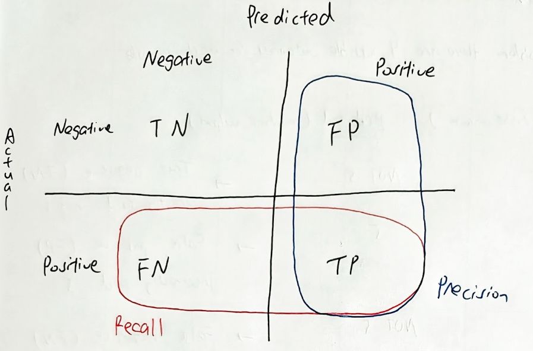

# Classification 
This project follows the structure and content of *Hands-on Machine Learning with Scikit-Learn, Keras, and TensorFlow* 2nd Ed by Aurélien Géron Chapter 3

This readme will focus on the concepts I have learnt in this chapter 

## Cross-Validation 🔁
A method to evaluate model performance through: 
- separate data into folds eg, fold A,B,C
- train on fold A, B, test on fold C
- Permuate the folds used for training and testing 
- Average the results

Cross Validation is a broad category of data evaluation methods, one of them is K-fold validation

### K-Fold validation 

K-fold validation is to split the datasets into K number of parts of equal size, then perform cross valiation on the parts 

Code: 
```python
from sklearn.model_selection import cross_val_score
scores = cross_val_score(model, X, y, cv=3)
```

This code performs 3-fold cross-validation.
We can additionally use the scoring parameter to decide the scoring function, the metric to evaluate 

## Confusion matrix 
A confusion matrix is a complete table of all possible actual and predicted combinations of labels predicted 

For a binary classifier, there are 4 possible outcomes for each instance 
- True Negative (TN)
- False Positive (FP)
- False Negative (FN)
- True Positive (TP)

### Precision
Precision = TP/ (TP + FP)

### Recall
Recall = TP / (TP + FN)

### F1 Score
F1 Score =  2 * (precision * recall) / (precision + recall)

Confusion matrix illustration:


### Recall-Precision Tradeoff 
When doing classification, there must be some kind of threshold to determine what the outputs are.

If we decrease the threshold and let the classifier be more "lenient", recall would go up because by probability, there will be more TP, but precision would go down 

If we increase the threshold and let the classifer "play safe", precision would go up as there will only be left with the most probable ones, but recall would drop because some TPs will be missed 

How to determine the threshold depends on the context of the model 


